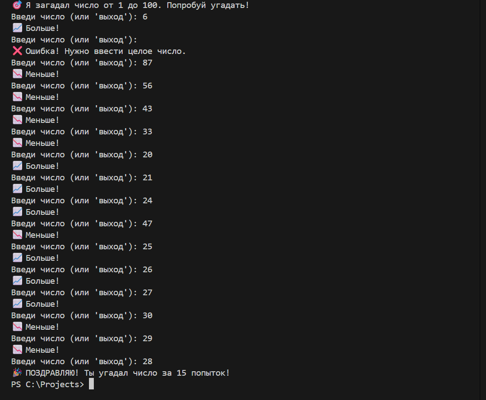

# 🎯 Игра "Угадай число" (Guess the Number)

Это мой второй проект на Python. Простая, но увлекательная игра, где компьютер загадывает случайное число, а ты должен найти его, используя подсказки.

---

### 📸 Как это выглядит:


### 🚀 Что умеет программа:
* **Генерация случайных чисел:** Каждый раз новое число от 1 до 100.
* **Умные подсказки:** Сообщает, больше или меньше твой ввод относительно загаданного числа.
* **Валидация (защита от дурака):** Если ввести текст вместо цифр, игра не сломается, а попросит повторить ввод.
* **Подсчет попыток:** В конце ты узнаешь, насколько ты крутой детектив!

### 🛠 Технологии:

* Работа с типами данных (`int`, `str`).
* Обработка пользовательского ввода.
* Цикл `while` и логика `if/elif/else`.

### 📦 Инструкция по запуску:
1. Убедись, что у тебя установлен **Python**.
2. Скачай файл `main.py`.
3. Открой терминал (или PowerShell) в папке с файлом.
4. Введи команду:
   ```bash
   python main.py
